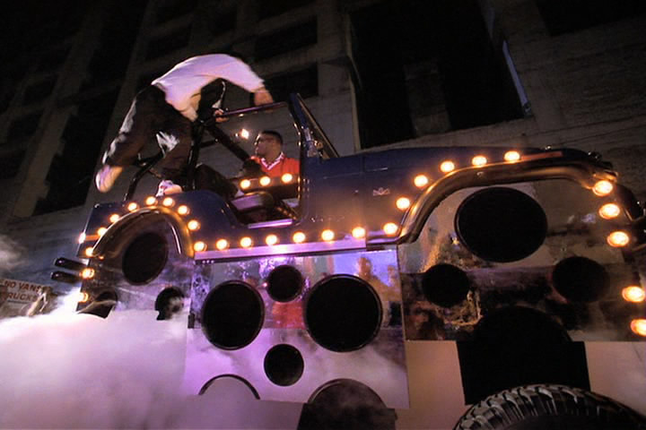

# Guilde des DJs

Voleurs | Tricksters

## Caractéristiques
- Lunettes de soleil
- Haut-parleurs qui se déploient à partir de l'épaule comme **Prédateur**
- Tables tournantes holographiques

## Aptitudes
- À l'instar de la guilde des sonorisateurs, utilisent eux aussi le son (ou plutôt ici la musique) pour contrôler les esprits (en pensant à la première rangée de l'**Artik After** qui bougeaient de façon synchrone assez pour faire osciller la barrière de sécurité) et détruire les objets... 
    > Peut-être, de cette façon, les DJ sont-ils à mi-chemin entre les sonorisateurs (qui font généralement le bien) et les musiciens (qui, tels des forgerons, sont plutôt là pour créer, par exemple, les outils, et sont par le fait même neutres)
    > Le côté obscure de la force? Peut-être qu'ils essaient de «recruter» des sonorisateurs en les attirant avec de la musique *bien mixée* (pour une fois), et/ou controler leur esprit?

## Armes
- Genre de **Dubstep Gun** comme dans *Saint Row*
- Tank DJ comme le monster truck dans *The Pest*
    
    [Pour le déploiement...](https://youtu.be/BNCfM3BhYAk)