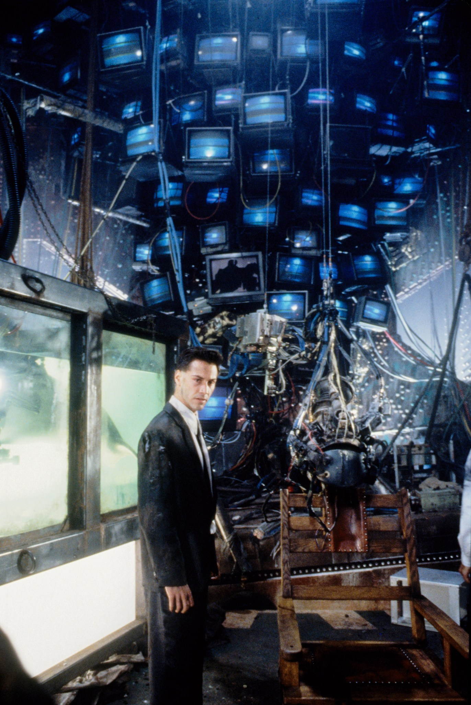
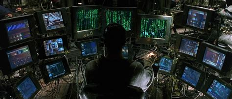
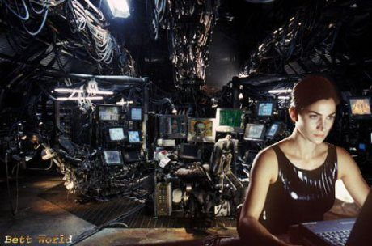

Guilde Vidéo

*Trouver un nom pour la guilde

Gatekeepers | Big Brother

## Caractéristiques
- Habitent dans des salles d'aiguillage, câbles partout

## Aptitudes
- Maîtrise du Time Code
- Écrans vidéos faisant office de portails
- Projecteurs vidéos qui ouvrent des portails (comme jeu **Portal**)
- Des portails physiques (forme de téléportation) ou voyage dans le temps (Time Code)
- Gardiens du Réseau, maîtres des clés
- Lien à faire avec BlackMagic
