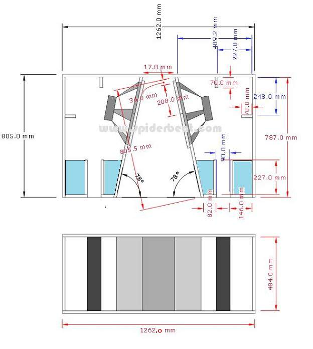
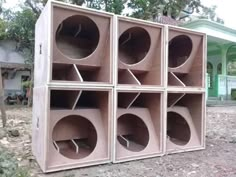
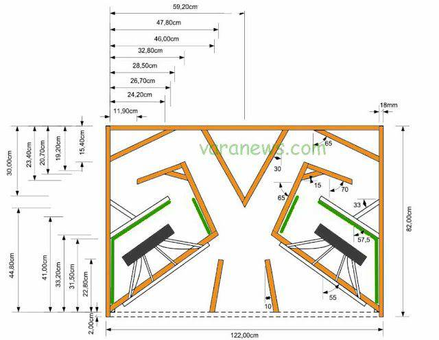
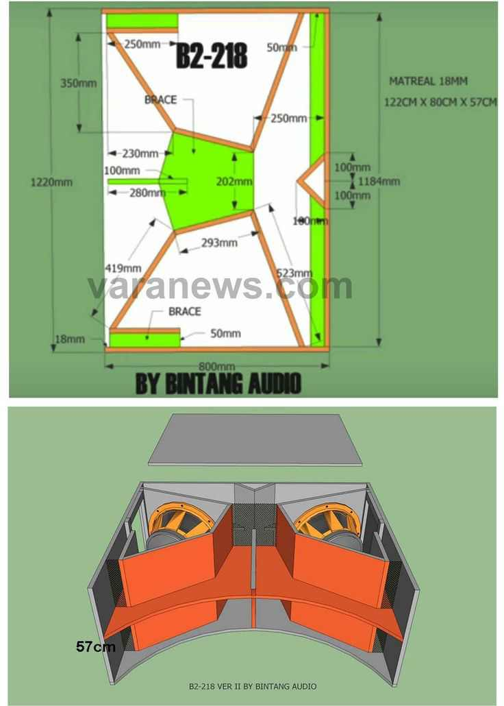
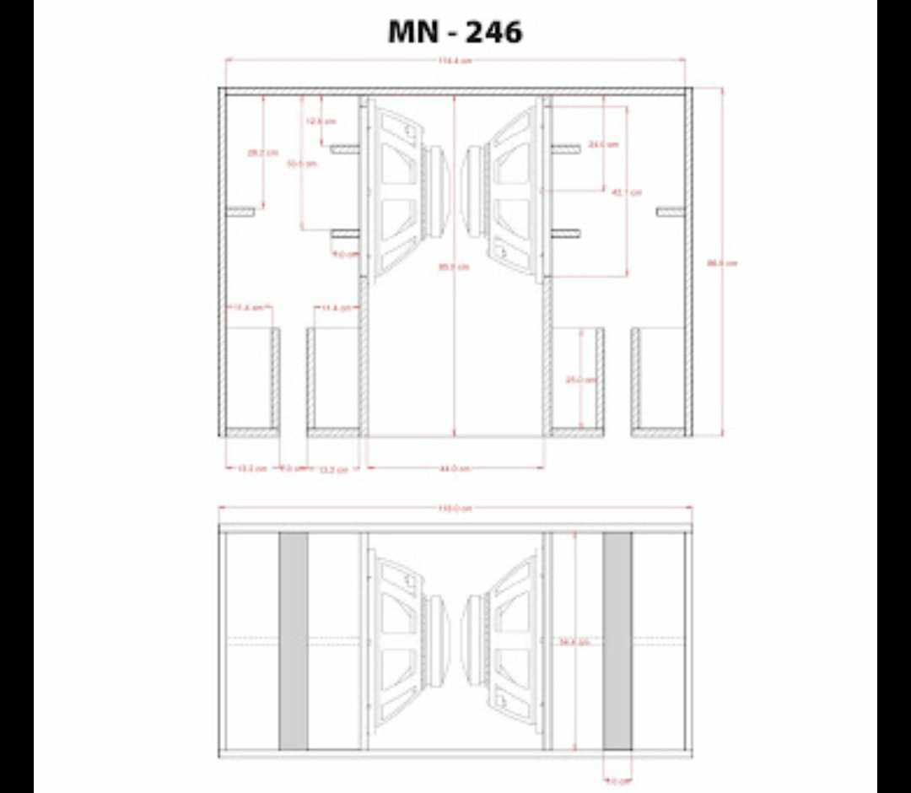
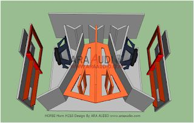
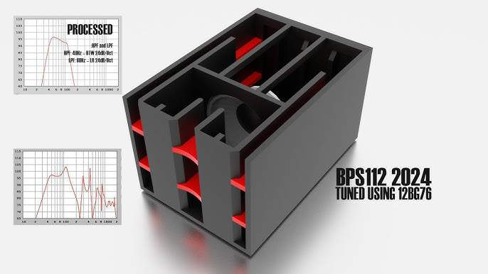

# Palais de l'empereur Nexo

QG de l'Empereur
Lieu où jadis s'est entraîné le Sonorisateur Suprème?

## Structure
- Basée sur l'équipement de sonorisation
- Forme du hall comme l'intérieur d'un sub
- Plafond du hall à l'angle avec haut-parleurs incrustés
- Motifs sur le plancher/tapis comme la vue de haut du plan d'un haut-parleur (style *Shining*)

